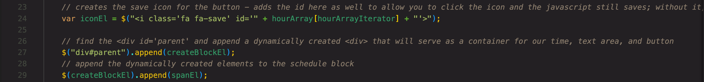
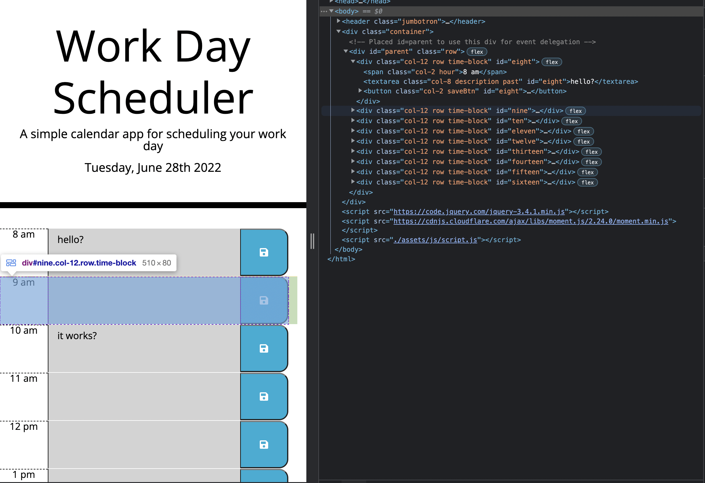
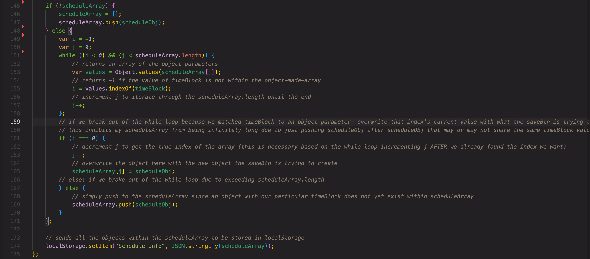

# Interactive-daily-planner
## Description
This code is used to populated a dynamically created calender that saves your tasks upon reload and changes background colors according to the current time. Multiple Third Party APIs were used to create this product and are highlighted below.

## Built With:
* HTML
* CSS
* JavaScript

## Key Features
### Third Party APIs
For this hourly scheduler I used several different third-party APIs. While each API used fulfilled its niche, JQuery and Bootstrap were both main characters in the design of this product. 

Through JQuery, I dynamically created and appended the schedule's time blocks and the elemnts within them. While doing so, I set the necessary classes to implement a bootstrap row on each schedule's time block and then another one within that to style the three elements.

Note - Moment.js was used to populate the date in the header as well as assign the time to each time block; however, JavaScript Date objects were used to conduct the logic for comparing times and coloring the backgrounds respectively.

### While Loop
I implemented my first while loop to decide how to store the saved texts and overwrite the same object once saved over. The variabel scheduleArray is the variable called from the localStorage. The -1/0 logic returned from the .indexOf as well as scheduleArray.length were both used to maintain the while loop and iterate through the array. When the loop broke, an if statement handled logic as to how to update the scheduleArray and saves it back to the localStorage. I honestly am pretty proud of this little piece of logic.

View the live page [here](https://ahudg.github.io/Interactive-daily-planner/)

## Contributions
Made by Andrew Hudgins :)